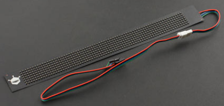

DFRobot_MCP23017
===========================

* [English Version](./README.md)

这款 RGB 软屏由 7x71 RGB 灯组成。 它通过串口与主控通讯，显示字符串，改变字体和背景颜色。
您可以设置显示亮度和移动速度，修改和显示消息列表的内容。
* 特征
1. 支持软串口通讯，波特率19200




## 产品链接（[https://www.dfrobot.com.cn/goods-2651.html](https://www.dfrobot.com.cn/goods-2651.html)）
    SKU: DFR0597  
   
## 目录

* [概述](#概述)
* [库安装](#库安装)
* [方法](#方法)
* [兼容性](#兼容性)
* [历史](#历史)
* [创作者](#创作者)

## 概述

这是一个 Arduino IDE 库，可以帮助 Arduino 与 7x71 Flexible RGB LED Matrix 进行通信。该库使通过串行配置传感器变得容易

## 库安装

使用此库前，请首先下载库文件，将其粘贴到\Arduino\libraries目录中，然后打开examples文件夹并在该文件夹中运行演示。

## 方法

```C++
  /**
   * @fn DFRobot_SerialScreen771
   * @brief DFRobot_SerialScreen771 构造函数
   * @param s_ 抽象类Stream，用户需传递它的串口子类对象
   */
  DFRobot_SerialScreen771(Stream &s_);
  ~DFRobot_SerialScreen771();
  /**
   * @fn begin
   * @brief 屏初始化。
   * @return  初始化状态
   * @retval true  初始化成功
   * @retval false 初始化失败
   */
  bool begin();
  /**
   * @fn setMoveMode
   * @brief 设置横幅信息移动模式。
   * @param m_  移动方向
   * @n     eMoveLeft        横幅左移动 
   * @n     eMoveRight       横幅右移动 
   * @n     eMoveHold        横幅不移动，静止不动
   * @n     eMoveUp          横幅上移
   * @n     eMoveDown        横幅下移
   * @n     eMoveFlash       横幅闪烁
   * @return  设置状态
   * @retval true  设置成功
   * @retval false 设置失败
   */
  bool setMoveMode(eMoveMode_t m_);
  /**
   * @fn setDispalyColor
   * @brief 设置屏显示的前景和背景色。
   * @param font  字体信息的显示颜色
   * @n     eColorRed      red
   * @n     eColorYellow   yellow
   * @n     eColorGreen    green
   * @n     eColorCyan     cyan
   * @n     eColorBlue     blue
   * @n     eColorPurple   purple
   * @n     eColorWhite    white
   * @n     eColorBlack    black
   * @param shading  字体的底纹
   * @n     eColorRed      red
   * @n     eColorYellow   yellow
   * @n     eColorGreen    green
   * @n     eColorCyan     cyan
   * @n     eColorBlue     blue
   * @n     eColorPurple   purple
   * @n     eColorWhite    white
   * @n     eColorBlack    black
   * @return  设置状态
   * @retval true  设置成功
   * @retval false 设置失败
   */
  bool setDispalyColor(eColorMode_t font, eColorMode_t shading);
  /**
   * @fn setBrightness
   * @brief 设置亮度等级，等级越高，亮度越亮。
   * @param b_  亮度等级
   * @n eBrightLevel_1    1级亮度
   * @n eBrightLevel_2    2级亮度
   * @n eBrightLevel_3    3级亮度
   * @n eBrightLevel_4    4级亮度
   * @n eBrightLevel_5    5级亮度
   * @n eBrightLevel_6    6级亮度
   * @n eBrightLevel_7    7级亮度
   * @n eBrightLevel_8    8级亮度
   * @return  设置状态
   * @retval true  设置成功
   * @retval false 设置失败
   */
  bool setBrightness(eBrightLevel_t b_);
  /**
   * @fn setMoveSpeed
   * @brief 设置横幅移动速度。
   * @param s_  移动速度级别，级别越高，移动速度越快
   * @n eSpeedLevel_1    1级移动速度
   * @n eSpeedLevel_2    2级移动速度
   * @n eSpeedLevel_3    3级移动速度
   * @n eSpeedLevel_4    4级移动速度
   * @n eSpeedLevel_5    5级移动速度
   * @n eSpeedLevel_6    6级移动速度
   * @n eSpeedLevel_7    7级移动速度
   * @n eSpeedLevel_8    8级移动速度
   * @return  设置状态
   * @retval true  设置成功
   * @retval false 设置失败
   */
  bool setMoveSpeed(eSpeedLevel_t s_);
  /**
   * @fn setMessageList
   * @brief 设置信息列表，此屏可存储8个信息列表，用户可以通过此函数修改任意列表中的内容。
   * @param banN  banN  显示信息列表序号集合
   * @n eBanner_1 or 1 << 0 设置第1个信息列表中的内容
   * @n eBanner_2 or 1 << 1 设置第2个信息列表中的内容
   * @n eBanner_3 or 1 << 2 设置第3个信息列表中的内容
   * @n eBanner_4 or 1 << 3 设置第4个信息列表中的内容
   * @n eBanner_5 or 1 << 4 设置第5个信息列表中的内容
   * @n eBanner_6 or 1 << 5 设置第6个信息列表中的内容
   * @n eBanner_7 or 1 << 6 设置第7个信息列表中的内容
   * @n eBanner_8 or 1 << 7 设置第8个信息列表中的内容
   * @n eBanner_ALL or 0xFF 将所有信息列表设置为同一内容
   * @n eBanner_1 ~ eBanner_7可以任意组合，表示将这两个信息列表设置为同一内容，例： eBanner_1 | eBanner_8 表示显示第1个和第8个信息列表的内容设置为同一内容。
   * @n message_ 信息内容
   * @return  设置状态
   * @retval true  设置成功
   * @retval false 设置失败
   */
  bool setMessageList(uint8_t banN, const char *message_);
  bool setMessageList(eBanner_t banN, const char *message_);
  /**
   * @fn displayBanner
   * @brief 显示信息列表中的横幅信息，此屏存储了8个数据列表信息，用户可以通过此函数按序显示其中一个或多个信息列表
   * @param banN  banN  显示信息列表序号集合
   * @n eBanner_1 or 1 << 0 显示屏中储存的第1个信息列表横幅信息
   * @n eBanner_2 or 1 << 1 显示屏中储存的第2个信息列表横幅信息
   * @n eBanner_3 or 1 << 2 显示屏中储存的第3个信息列表横幅信息
   * @n eBanner_4 or 1 << 3 显示屏中储存的第4个信息列表横幅信息
   * @n eBanner_5 or 1 << 4 显示屏中储存的第5个信息列表横幅信息
   * @n eBanner_6 or 1 << 5 显示屏中储存的第6个信息列表横幅信息
   * @n eBanner_7 or 1 << 6 显示屏中储存的第7个信息列表横幅信息
   * @n eBanner_8 or 1 << 7 显示屏中储存的第8个信息列表横幅信息
   * @n eBanner_ALL or 0xFF 按序显示所有存储信息列表
   * @n eBanner_1 ~ eBanner_7可以任意组合，表示需按序显示选中的横幅信息，例： eBanner_1 | eBanner_8 表示显示第1个和第8个横幅信息。
   * @return  None
   */
  void displayBanner(uint8_t banN);
  void displayBanner(eBanner_t banN);
  /**
   * @fn displayMessage
   * @brief display information
   * @param message_  display information   
   */
  void displayMessage(const char *message_);
  /**
   * @fn setFullScreenColor
   * @brief Full screen lights up to show a certain color
   * @param color_  RGB color
   * @n     eColorRed      red
   * @n     eColorYellow   yellow
   * @n     eColorGreen    green
   * @n     eColorCyan     cyan
   * @n     eColorBlue     blue
   * @n     eColorPurple   purple
   * @n     eColorWhite    white
   * @n     eColorBlack    black
   * @return  set state
   * @retval true  success
   * @retval false failed
   */
  bool setFullScreenColor(eColorMode_t color_);
```

## 兼容性

MCU                | Work Well | Work Wrong | Untested  | Remarks
------------------ | :----------: | :----------: | :---------: | -----
Arduino uno |       √      |             |            | 
Arduino Leonardo |       √      |             |            | 
Arduino Mega2560  |       √      |             |            | 

## 历史

- 2019/07/18 - 1.0.0 版本
- 2022/01/24 - 1.1.0 版本

## 创作者

Written by Arya(xue.peng@dfrobot.com), 2021. (Welcome to our [website](https://www.dfrobot.com/))


